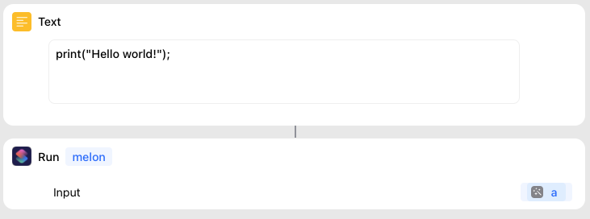

# Introduction

**melon** is an **orthogonally-persistent** programming language designed for creating **blazingly fast** automations for Apple devices.

It is similar to Scriptable, but it is **open source** and **built only using Siri Shortcuts**. You don't need to install an app to use melon.

## Installation

Start by installing `melon` Shortcut to your device from [here](https://www.icloud.com/shortcuts/f32873be34104da59020c32791cf57c3). 

This shortcut will serve as our interpreter. 

## Quickstart

### How to use

You can go to the [web playground](https://melon-lang.github.io/playground/) to experiment with melon language features. This playground contains a web editor. Whenever you press **Run** button, it sends your code to `melon` Shortcut that you installed on your device. Then your code gets executed locally by the shortcut.

Or, if you want to use melon within your own Shortcut, just input your code as text to `Run Shortcut (melon)` action in your shortcut as down below.

<div align="center">
    
</div>

### Hello world program

Try running this snippet.

```
print("Hello world!");
```

In melon, you use native `print` function to display text or other types of data. melon uses `Show Result` action to achieve this.

Also, lines in melon must end with a semicolon.
