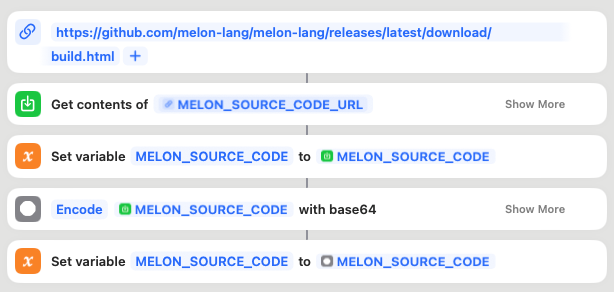
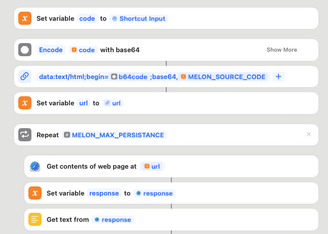
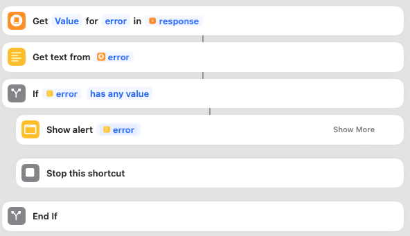
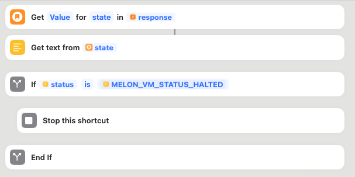
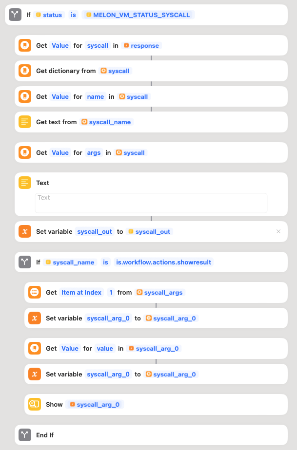

# Contribution  <!-- {docsify-all} -->

Melon consists of several parts that anyone can contribute. This document explains how each component of Melon works. Some parts may require knowledge in interpreter design, though you other parts don't require this knowledge, so there is always somewhere you can contribute to.

## Shortcut Design

Melon is a shortcut. Whenever an user wants to execute their melon code, their code doesn't leave the Shortcut. Melon, downloads the latest version of the interpreter code from Github, and executes it using [JavaScript execution trick](https://talk.automators.fm/t/tip-running-javascript-in-shortcuts-ios-macos/16575). The interpreter is written in TypeScript. 

<div align="center">


<br/>
*Shortcut downloads the interpreter source code from Github*
</div>

In Melon Shortcut, the `Shortcut Input` is the user source code. When we start JavaScript execution, we need to pass the user source code as well. As you can see below, Shortcut uses `Get contents of web page` action with both the interpreter's code and user's Melon code.

<div align="center">


<br/>
*Shortcut executes interpreter with user source code.*
</div>

You may ask why we have a `Repeat` action in the Shortcut, and what is `MELON_MAX_PERSISTENCE`? 

Since Melon interpreter needs to switch from Javascript to Shortcut actions from time to time (e.g. when you call the `print()` native function), interpreter pauses itself when needed. In those cases, there has to be a Shortcut action to be completed. For instance, if you write a Melon program that uses `print()`, you implicitly use `Show Result` action. At the time `print()` gets called, the interpreter pauses (meaning `Get contents of web page` action stops for that `Repeat` iteration), we execute the `Show Result` action. In the next `Repeat` iteration, we resume the interpreter from where it was paused. This is the reason why we need to repeat this process as many times as needed. `MELON_MAX_PERSISTENCE` is a huge number. It is probably impossible for anyone to write a code that will require more iterations than this number.

<div align="center">


<br/>
*`MELON_MAX_PERSISTENCE` in the Melon Shortcut*
</div>

Response we get from `Get contents of web page` tells about the state of the interpreter. Is it finished running user code? Did a native function like `print()` got called, so `Show Result` action needs to be run? Did a runtime error occur like division by zero? 

All of this information is outputted by the interpreter as the response of `Get contents of web page`. Response is in JSON format (dictionary). 

**1. An Error Occured**

- If there is an error occured while running the interpreter, the error message will be shown, and then the shortcut stops running.

<div align="center">


<br/>
*Error handling in Melon Shorcut*
</div>

**2. Execution is Finished**

- If user's code is succesfuly executed, the Shortcut stops running.

<div align="center">


<br/>
*Melon Shorcut stops after user code is finished*
</div>

**3. A Native Function was Called**

- If cases 1 and 2 above are not true, this means that a native function got called, and the Shortcut has to do something about this. This interpreter status is named `System call (Syscall)` in Melon. And this is what Shortcut does in that case.

<div align="center">


<br/>
*Melon Shorcut handles a Syscall (Native Function)*
</div>

- After checking that status is indeed equal to `Syscall`, Shortcut tries to understand what is the name of the Syscall. The name denotes what action should be run. In the example above, Shortcut checks if the syscall name is `is.workflow.actions.showresult`. This is the action id Apple gave to the `Show Result` action. Shortcut, gets the arguments of the syscall (the stuff to display in this case).

- Another example is how `input()` action is handled. `input()` is a native function that returns what user prompts. So, the syscall must actually return a value. This is done by the Shortcut using `syscall_out` variable. Whatever is in `syscall_out` variable, gets feed to the interpreter (`Get contents of web page` action) in the next `Repeat` iteration. Beware that Shortcut checks if syscall name is `is.workflow.actions.prompt`, because this is the id of `Ask for text` action.


<div align="center">


<br/>
*Melon Shorcut handles `input()`*
</div>

## Interpreter Design

Melon is a bytecode language. First, the user's code gets compiled into Melon bytecode. Then, this bytecode gets executed by Melon VM. The Melon VM is orthogonally-persistent, meaning it can pause/resume execution. This is the architecute we exploit whenever there is a system call like `print()`. 

To be orthogonally-persistent, Melon VM should be able to serialize itself whenever it gets paused. This state, then can be used anytime to resume execution from where it was left off. For this, Melon Interpreter uses [class-transformer](https://github.com/typestack/class-transformer) TypeScript package, that makes it easier to serialize classes.

`@Type( ()=> Value)` decorators are there in the Melon codebase so that when deserializing, `class-transformer` can map each object to correct class, creating instances.

The code you will see will be in the guides below will be TypeScript, and show how the values, control flow etc. are handled internally. So, try not to get confused :)

### Values

This content is about `src/value.ts` file in the codebase.

`Value` is a class that represent types in Melon. For each type, there is a `Value` subclass. For instance `StringValue` holds all things related with Melon strings. 

`Value`s have a `value` field, that stores the value in Javascript representation. For a Melon string `"Hello world!"`, we have an underlying `StringValue` that has the value field set to `"Hello world!"` in Javascript. To create a Melon list `[1,2,3]`, you can use `new ListValue([new NumberValue(1),new NumberValue(2),new NumberValue(3)])`
 in Javascript. The constructor of `Value` subclasses expect the JS representation of the value as an only argument. So, `new BooleanValue(true)` gets you a Melon `true`.

`repr` and `str` getters under `Value` class are how a certain type is represented whenever it is converted to string. For instance, for a list of 1 element that is an empty string, the string representation is `[""]`. For strings, `str` is the original value itself, but `repr` surrounds the original value with double quotes.

`equals(other: Value)` check if the value is equal to the other given value. Each type implements this function differently. 

`ValueMethod` decorator makes a method available to Melon language. For instance, let's look at `trim()` method of strings.

```typescript
    // in src/value.ts

    class StringValue extends Value {
        // ...
        
        @ValueMethod({ args: [] })
        trim(lineNumber: number, ...args: Value[]): Value {
            return new StringValue(this.value.trim());
        }

        // ...
    }
```

`trim()` method doesn't accept an argument, so the `args` field is an empty array. `ValueMethod` registers `trim` as a method that can be used in Melon. You can see that the function returns another `StringValue`.

If you add a function under `StringValue` (or any other type) but don't decorate it with `ValueMethod`, you cannot call it from Melon. Here is an example where you fail:

```typescript

    // in src/value.ts

    class StringValue extends Value {
        // ...

        make_it_fun(lineNumber: number, ...args: Value[]): Value {
            return new StringValue("Here is a joke for you: " + this.value);
        }

        // ...
    }
```

Try using it in melon:

```melon
let my_str = "I am handsome";
my_str.make_it_fun() // Throws an error. No such member method.
```

Since, `str`, `repr`, and `equals()` are not decorated by `ValueMethod`, they are not accesible in Melon. They are implemented to be used as helpers in Javascript. Though, `__str__`, `__eq__` methods are available in Melon, providing same functionality. Take a look:

```melon
    let my_num = 42;

    my_num.__str__(); // returns "42"
    str(my_num); // returns "42"

    my_num.__eq__(42); returns true
    my_num == 42; // returns true
```

So, you can see that methods like `__eq__` are what operators like `==` use in the back. You can really sum two number `3` and `2`, with this way in Melon: `(3).__add__(2)`. Native `str()` function, just calls `.__str__()` method in the back.

### Testing Your Changes

Whenever you are developing a new feature, and you want to test it, you can just go to `test/integration.test.ts`, add a new test case there with your functionality being used.

We need a lot of test cases, so even if you are not adding a new functionality, you can still add test cases to the existing ones. This would be a equally great contribution. 